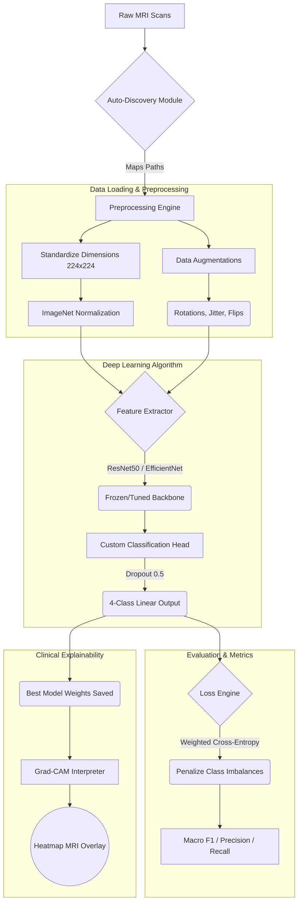

# Neural-NEXUS: Robust Brain Tumor Analysis

This repository houses a comprehensive, AI/ML-driven deep learning system designed for robust brain tumor analysis and classification using MRI imaging. The system was meticulously developed to combat fundamental real-world clinical challenges such as dataset class disparity, inter-patient variability, and black-box interpretability issues.

## 🌟 Key Features

- **Automated Kaggle Path Discovery:** Dynamically locates and normalizes tumor classes regardless of Kaggle directory structures to prevent execution failures.
- **Advanced Preprocessing:** Employs ImageNet stabilization and aggressive geometry/color augmentations (rotations, flips, jitters) to drastically enhance clinical generalization.
- **Dynamic Inverse-Class Weighting:** Computationally resolves extreme dataset imbalances, ensuring rare classes are mathematically penalized equal to common classes.
- **Deep Transfer Learning:** Replaces primitive architectures with a robust `EfficientNet/ResNet50` classifier backbone customized with high dropout (0.5) to isolate pure tumor features.
- **Clinical Explainability (Grad-CAM):** Instead of issuing blind predictions, the architecture overlays vivid heatmaps onto the native MRI structure, highlighting the specific structural anomalies the AI evaluated to form its diagnosis.

---

## 🛠️ System Architecture

Below is the execution flow of our Brain Tumor Detection Pipeline:

---

